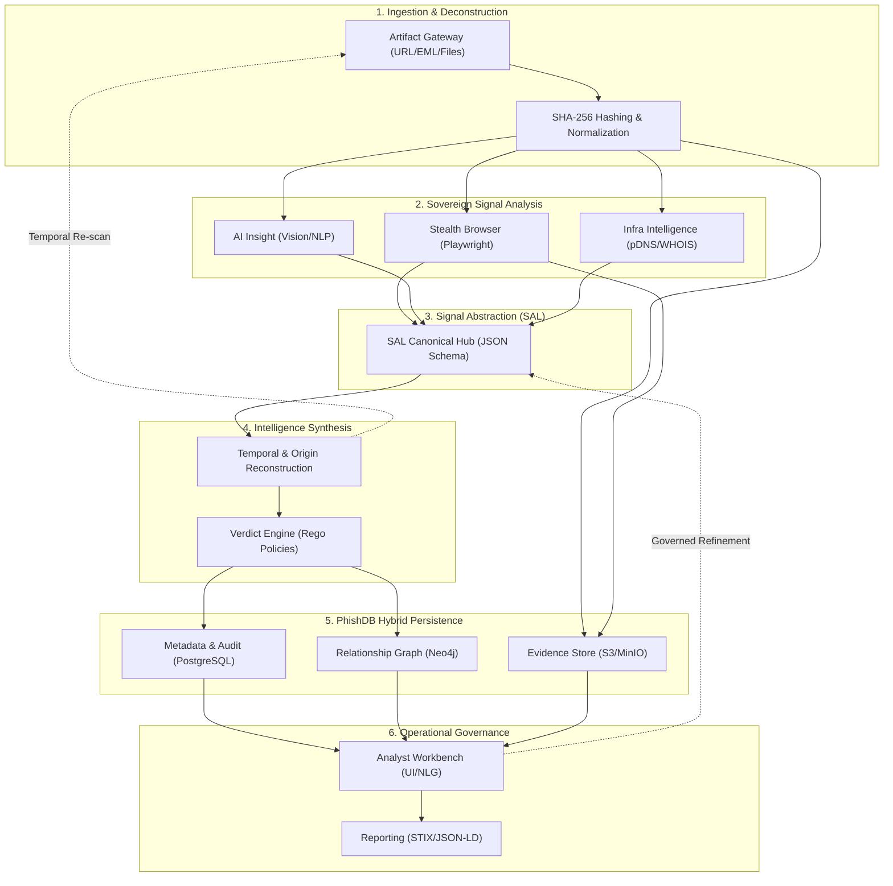

# PhishVault-2 (2026)
## AI-Assisted Temporal & Origin Path Phishing Detection & Intelligence Framework
### FULL TECHNICAL WORKBOOK & SYSTEM DESIGN SPECIFICATION

Authors: PardhuVarma, Tejaswini  
Status: Design-Locked (Pre-Implementation)  
Ethics: Defensive-only, Non-attributional, Explainable-by-design

---

## 1. INTRODUCTION & EVOLUTION

PhishVault-2 (PV2) is a second-generation evolution of the original PhishVault system. While the first generation focused on heuristic-based URL scanning, PV2 shifts to an **Atomic Intelligence Framework** designed for campaign-scale analysis, temporal tracking, and probabilistic origin reconstruction.

### The PV1 to PV2 Evolution
| Feature | PhishVault v1 | PhishVault-2 |
| :--- | :--- | :--- |
| **Logic** | Heuristic Strings & Regex | Signal Abstraction Layer (SAL) |
| **Analysis** | Synchronous URL Fetching | Asynchronous Multi-Artifact Pipeline |
| **Decision** | Weighted Score Threshold | Governed Verdict Engine + AI Assist |
| **Discovery** | Single IOC Detection | Campaign Clustering & Identity Mapping |
| **Output** | Verdict (Safe/Malicious) | Intelligence Graph + Evidence Trails |

---

## 2. CORE DESIGN PRINCIPLES

1.  **SAL-Driven Architecture**: Every analysis result must be normalized into a Signal Abstraction Layer format before being consumed by decision engines.
2.  **Sovereign Engines**: Individual scanning engines (JS, ML, Network) must be isolated, replaceable, and have no knowledge of each other.
3.  **Governance over Automation**: AI provides confidence-weighted signals, but the **Verdict Engine** applies deterministic rules and analyst-governed logic.
4.  **Temporal Primacy**: A single scan is a snapshot. PV2 tracks artifacts over time to detect cloaking and dormant payloads.
5.  **Probabilistic Attribution**: Avoid hard attribution. Use infrastructure overlaps and behavioral patterns to map "Origin Paths" with associated confidence.
6.  **Evidence-First Reporting**: Every verdict must include clickable evidence (DOM snippets, TLS certs, screenshot hashes).

---

## 3. SUPPORTED ARTIFACT TYPES

PhishVault-2 accepts and normalizes the following:

- URLs / Websites
- Emails (raw text, .eml, .msg)
- Attachments (HTML, PDF, images, office docs)
- Embedded URLs and QR codes
- Bulk IOC feeds (CSV, JSON)

All artifacts are converted into a canonical internal schema
with versioning and lineage tracking.

---

## 4. HIGH-LEVEL ARCHITECTURE

The PV2 architecture is a high-fidelity intelligence pipeline that normalizes chaos into structured, campaign-scale insights.



### Component Interaction & Workflow

The PhishVault-2 workflow is designed as a **Unidirectional Data Flow** with specialized state management at each stage.

1.  **Ingestion & Deconstruction (The Gateway)**
    - **Process**: Receives raw artifacts via REST API or Bulk Feed. Each input is assigned a unique `artifact_id` and hashed using SHA-256 for content deduplication.
    - **Decomposition**: Emails are decomposed into sub-artifacts (headers, body sections, attachments), creating a parent-child relationship tree in the metadata layer.
    - **Distribution**: Artifacts are dispatched to the message broker (RabbitMQ/Redis) for parallel engine processing.

2.  **Sovereign Parallel Analysis (The Signal Engines)**
    - **Behavior**: Analysis engines (Stealth Browser, Vision AI, NLP, Network Intel) operate as independent, stateless microservices.
    - **Isolation**: Engines perform "Deep Dives" into the artifact without prior knowledge of other engine findings, preventing signal bias.
    - **Output**: Every engine produces raw technical data, which is then mapped to the Signal Abstraction Layer.

3.  **Signal Abstraction Layer (The Central Hub)**
    - **Role**: Normalizes diverse engine outputs into a canonical JSON schema.
    - **Attributes**: Every signal includes `signal_type`, `normalized_confidence`, and a verifiable `evidence_blob`. 
    - **Governance**: SAL acts as the single source of truth for all downstream intelligence modules.

4.  **Intelligence Synthesis & Reconstruction (The Intelligence Layer)**
    - **Correlation**: The Correlation Engine aggregates SAL signals to identify patterns across multiple artifacts.
    - **Origin Mapping**: Probabilistically reconstructs infrastructure "Path Fingerprints" by pivoting through Graph DB nodes (ASNs, TLS Fingerprints, JA3 hashes).
    - **Verdict Engine**: Applies deterministic **Rego (Open Policy Agent)** rules to SAL signals to generate a final risk verdict.

5.  **PhishDB Hybrid Persistence (The Storage Tier)**
    - **Performance Tiers**:
        - **PostgreSQL**: Handles relational metadata, signal logs, and immutable audit trails.
        - **Neo4j**: Powers the campaign graph, allowing real-time traversal of attribution pivots.
        - **S3/MinIO**: Immutably stores "Ground Truth" evidence (raw artifacts, screenshots, DOM dumps).

6.  **Operational Governance (The Human Layer)**
    - **Analyst Workbench**: Loads unified views from PhishDB, providing **Explanation Trees** for every verdict.
    - **AI-Assisted (NLG)**: Uses Natural Language Generation to translate complex technical signals into SOC-ready summaries.
    - **Intelligence Export**: Packages campaign data into industry-standard formats (STIX 2.1, JSON-LD) for external TIP ingestion.

---

## 5. FEATURE-BY-FEATURE TECHNICAL SPECIFICATION

---

### 5.1 Multi-Artifact Ingestion Engine
**Technical Behavior:** 
Uses a factory pattern to handle different MIME types. Emails are parsed into header/body/attachment substructures. All inputs are deduplicated using `Base64(SHA256(RawBody))`.
**Schema:** `IngestedArtifact { id, type, raw_blob_path, metadata: {}, source_id }`

---

### 5.2 URL Canonicalization & Normalization
**Techniques:**
- **Punycode Transparency**: Automatically reveals `xn--` forms.
- **De-Tracking**: Strips known parameters (`utm_`, `fbclid`, `gclid`).
- **Redirect Unwinding**: Recursively follows 3xx and JS-based `window.location` redirects up to a depth of 12.
- **Output**: Canonical URL + `redirect_chain[]` metadata.

---

### 5.3 Email Parsing & Decomposition
**Capabilities:**
Parses `.eml` and `.msg` using RFC-822/MIME standards. Extracts X-Headers (X-Originating-IP, X-Mailer) and builds a relationship tree between the email and its nested components (body, links, attachments).

---

### 5.4 Attachment Safe Inspection (Non-Executable)
**Technical Spec:**
Static analysis only using a quarantined worker.
- **URL Extraction**: Regex-based extraction from text/HTML.
- **QR Decoding**: CV-based (OpenCV) detection in images.
- **Hashing**: pHash (Perceptual Hash) generation for visual matching against brand databases.

---

### 5.5 Headless Browser Analysis Engine (V2)
**Technical Spec:**
- **Runtime**: Containerized Playwright (Chromium/Webkit/Firefox).
- **Stealth**: Overrides `navigator.webdriver` and spoofing WebGL fingerprints to bypass common bot-detection (Akamai, Cloudflare).
- **Hooks**: Intercepts `fetch`, `XMLHttpRequest`, and `WebSocket` calls at the browser level.
- **Isolation**: Each scan runs in a fresh ephemeral Docker container with limited egress.

---

### 5.6 Lightweight Fetch & Header Analysis
**Behavior:**
Fast-path scanning using Go-based `fasthttp`. Inspects `Server`, `X-Powered-By`, and `Set-Cookie` headers for fingerprinting server-side kits (e.g., Freenom, phishing kits like "EvilGinx").

---

### 5.7 Email Header Intelligence (Authentication)
**Logic:**
Implements strict SPF/DKIM/DMARC validation. Checks `Return-Path` vs `From` header alignment and calculates "Envelope-Header Entropy" to detect spoofed domains.

---

### 5.8 Infrastructure & Hosting Intel
**Data Enrichment:**
Aggregates data from Passive DNS (pDNS) and WHOIS. Signals are raised for "T-1 Day" registrations and ASNs known for bulletproof hosting (e.g., specific Russian/Chinese TLDs).

---

### 5.9 Brand & Visual AI Impersonation
**Vision Architecture:**
Uses a **Siamese Neural Network** with a ResNet-50 backbone to compare page screenshots against a "Golden Set" of 500+ global brands.
- **Signal**: `visual_similarity_score > 0.85` triggers a high-confidence impersonation signal.

---

### 5.10 AI Phishing Language Analysis (NLP)
**Model**: Transformers-based (BERT/RoBERTa) fine-tuned on custom phishing datasets.
**Capabilities**: Detects "Urgency Sentiment" (e.g., "Action Required," "Suspending Account") and "Credential Solicitation Context" across multiple languages.

---

### 5.11 URL Lexical ML Analysis
**Feature Space:**
Uses character n-grams, entropy, and token analysis to detect "dGA-like" or "lookalike" URLs. Signal includes the top-N contributing lexical features.

---

### 5.12 Visual AI Comparison Hub
Exposes an API for comparing screenshots against internal clusters. Supports `pHash` (robust to resizing) and `dHash` (robust to color shifts) comparisons.

---

### 5.13 Campaign Similarity & Clustering Engine
**Algorithm:**
Uses **DBSCAN** clustering on a weighted feature vector:
`V = [DOM_Hash, JS_Fingerprint, TLS_Serial, ASN, Brand_Target]`
Produces `campaign_id` for grouped incidents.

---

### 5.14 Unified Signal Abstraction Layer (SAL)
**The Core Contract:**
Every engine MUST output this schema:
```json
{
  "artifact_id": "uuid",
  "engine_name": "JS_ENGINE",
  "signal_key": "OBFUSCATED_JS_DETECTED",
  "confidence": 0.95,
  "weight": 0.8,
  "evidence": { "snippet": "eval(atob(...))", "line": 45 },
  "tags": ["obfuscation", "evasion"]
}
```

---

### 5.15 Signal Weighting & Trust Model
**Technical Spec:**
Calculates the **Aggregate Signal Intensity (ASI)**.
- **Dynamic Weighting**: Weights are adjusted based on the `engine_trust_score` (historical accuracy of the engine).
- **Temporal Decay**: Signal weights decrease as the artifact ages (`e^(-λt)`), requiring re-scans for long-lived campaigns.

---

### 5.16 Verdict Engine v3 (Policy-Based)
**Logic:**
Implements **Rego (Open Policy Agent)** for defining verdict logic. 
*Example Rule:* If `visual_similarity > 0.9` AND `engine:WHOIS` reports `age < 7d`, verdict is `MALICIOUS`.

---

### 5.17 Governance & Explanation Engine
**Architecture:**
Uses a **Traceability Matrix** to map every verdict back to specific SAL signals.
- **Logical Proofs**: Generates a tree of "Because [Signal A] and [Signal B], then [Verdict]".
- **Natural Language Generation (NLG)**: Uses LLM templates to convert technical signals into analyst-readable summaries.

---

### 5.18 Audit & Analyst Override
**Immutable Controls:**
Every human-in-the-loop action is logged to an append-only ledger.
- **Override Logic**: Requires a mandatory `justification_id` and `evidence_attachment`.
- **Feedback Loop**: Overrides are used to re-train the Bayesian weights in the **Trust Model (5.15)**.

---

### 5.19 PhishDB Intelligence Vault
**Hybrid Storage Model:**
The vault is split into three performance-optimized tiers:
1. **Metadata Tier (PostgreSQL)**: Stores `Artifacts`, `Signals`, `Verdicts`, and `Audit Logs`. Uses JSONB for flexible signal storage.
2. **Relationship Tier (Neo4j)**: Stores the `Intelligence Graph`. Maps pivots between Domains, IPs, and SSL Fingerprints.
3. **Blob Tier (S3/MinIO)**: Immutably stores raw `.eml` files, full-page screenshots, and HTML DOM snapshots.

---

### 5.20 Campaign Intelligence Graph
**Storage**: Neo4j.
**Relationships**:
- `(:URL)-[:HOSTED_ON]->(:Domain)`
- `(:Domain)-[:RESOLVES_TO]->(:IP)`
- `(:IP)-[:PART_OF]->(:Campaign)`
**Query**: Finds "Islands of Infrastructure" where multiple unrelated domains share a specific TLS Fingerprint or JA3 hash.

---

### 5.22 Temporal Reconstruction Engine
**Algorithm**:
Creates a linear progression of state changes. 
`[T0: Clean] -> [T+4h: Dormant Redirect] -> [T+12h: Active Lure] -> [T+48h: 404/Taken Down]`.
Enables "Time-Travel Analysis" to see what an attacker showed a specific target IP at a specific time.

---

### 5.23 Origin Infrastructure Path Mapping
**Methodology**:
Maps the "Relay Chain" of attackers.
1. **Lure Host** (e.g., compromised WordPress)
2. **Intermediate Redirector** (Shortener or Cloudflare Worker)
3. **Payload Origin** (Bulletproof ASN)
This creates a "Path Fingerprint" used to group campaigns even if URLs change.

---

### 5.25 Origin Confidence Scoring
**Math:**
Confidence is calculated as the harmonic mean of the component engine confidences, adjusted by the "Attribution Entropy" of the specific ASN/Provider.

---

### 5.26 Analyst Workbench UI
**V2 Features:**
- **Dynamic Evidence Cards**: SAL signals are rendered as interactive cards with direct links to DOM source, network logs, and AI explanations.
- **Graph Topology View**: Interactive Neo4j visualization of campaigns.
- **Timeline Scrubber**: Synchronizes screenshots and network state across the temporal reconstruction.

---

### 5.27 Reporting & Evidence Export
**Capabilities:**
- **JSON-LD Export**: Standardized for integration with TIPs (Threat Intelligence Platforms).
- **STIX 2.1 Bundles**: Automatic generation of campaign bundles including SDOs (Domain, URL, Indicator).

---

### 5.29 Scan Sandbox & Egress Controls
**Technical Controls:**
- **Network Isolation**: Scans run in unprivileged namespaces with `iptables` rules preventing any internal network scanning.
- **Auto-Kill System**: A watchdog process monitors OOM/CPU spikes and terminates browser instances if they attempt to mine crypto or run complex WASM loops.

---

### 5.30 Abuse Prevention (The "Safe-Guard" Layer)
**Governance:**
- **submission_quota**: Verified identities receive higher limits.
- **Content Filtering**: Prevents submission of pre-defined sensitive organizational URLs to avoid leakage.

---

### 5.31 Scalability & CI/CD
**Infrastructure:**
- **Message Broker**: Uses RabbitMQ for distributing artifact jobs to worker clusters.
- **Horizontal Scaling**: Analysis workers scale based on queue depth to handle bulk submission of 10k+ URLs during incident response.

---

## 6. FINAL POSITIONING

PhishVault-2 is:
- A phishing intelligence framework
- Explainable by design
- Governed and ethical
- Campaign and origin focused
- Research and SOC ready

---

© 2026 PhishVault-2
